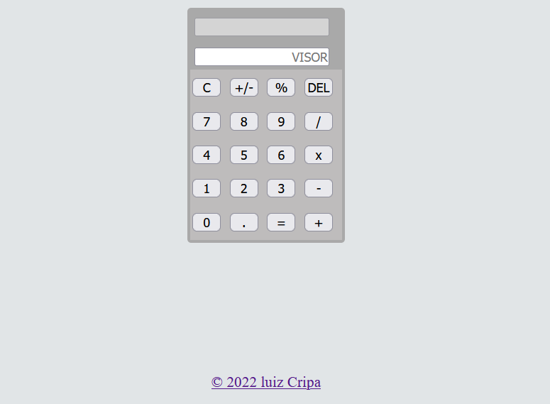

# CALCULADORA

>Calculadora para operação básica em javaScript

Projeto para estimular fixação e aprimoramento do uso de funções.

[Clique aqui para acompanhar](https://luizcripa.github.io/calculadora/)

🛠 Tecnologias aplicadas
⚙ HTML
⚙ CSS
⚙ JAVASCRIPT
⚙ GIT e GITHUB

[📬 Contato](https://www.linkedin.com/in/luiz-fernando-cripa/)